# 🌟 Buffaly Codex Embedded

**Unofficial Windows-first UI for OpenAI Codex**  
Run the official Codex agent in a beautiful browser UI - on your desktop, from your phone, or alongside the CLI.

[](https://github.com/Intelligence-Factory-LLC/Buffaly.CodexEmbedded)
[](https://dotnet.microsoft.com)
[](LICENSE)
[](https://github.com/Intelligence-Factory-LLC/Buffaly.CodexEmbedded/actions/workflows/release.yml)

## 🌟 What is Buffaly Codex Embedded?

**The Windows-first UI that makes OpenAI Codex even easier to use.**

Run the official Codex agent in a clean browser interface on your desktop, from your phone, or right next to the CLI.

You get:
- Multiple projects open at once (no more switching bewteen terminals)
- Natural editing, image paste, and full history
- Seamless switching between desktop, web, and phone
- Same powerful Codex agent under the hood


### 📸 See It In Action

Use the UI in your browser to manage all of your codex session, even those started by the CLI. Start a session in the terminal, then watch it appear in the web UI with full context and timeline.
Or start a session in the web UI and manage it from any browser. Use Tailscale to securely access the same UI from your phone, and keep the same session state and thread context across devices. 

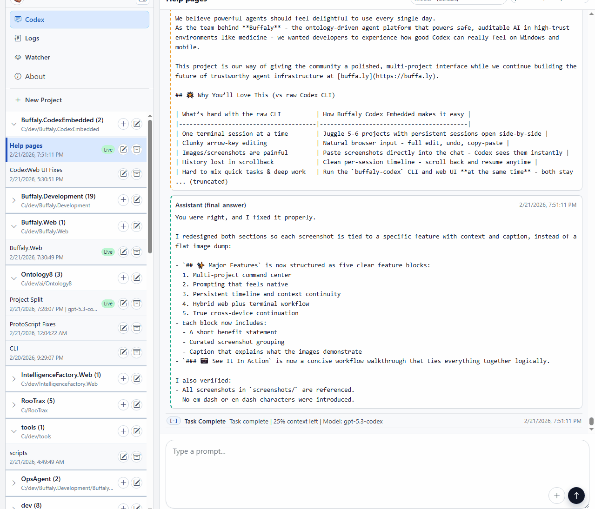

## ⚡ Quick Start

Download:
- Preferred (when a tagged release exists): [Download latest release](https://github.com/Intelligence-Factory-LLC/Buffaly.CodexEmbedded/releases/latest)
- If GitHub shows no releases: open [Actions release workflow](https://github.com/Intelligence-Factory-LLC/Buffaly.CodexEmbedded/actions/workflows/release.yml), open the latest successful run, then download artifact `release-win-x64-<version>`.

1. Extract the downloaded zip.
2. Open PowerShell 7 in the extracted package root folder (the folder with `release-manifest.json` and `install.ps1`).
3. Run:

```powershell
pwsh -ExecutionPolicy Bypass -File .\install.ps1
```

4. Open a new terminal and run:

```powershell
buffaly-codex-web
```

5. Open the URL shown after `Now listening on:`.

To run manually or from source, see [Detailed Install and Run Options](#-detailed-install-and-run-options).
For install issues, see [Troubleshooting](#troubleshooting).

## ✨ Major Features

The application is designed to mirror the Desktop Codex experience while also making the same experience available on mobile. Core features include:

### 1. Multi-project / mulit-session management

The project side bar lets you organize your Codex tasks by working directory and sessions. The same session names you use 
in the CLI appear in the sidebar, and you can have multiple sessions open at once without losing context.

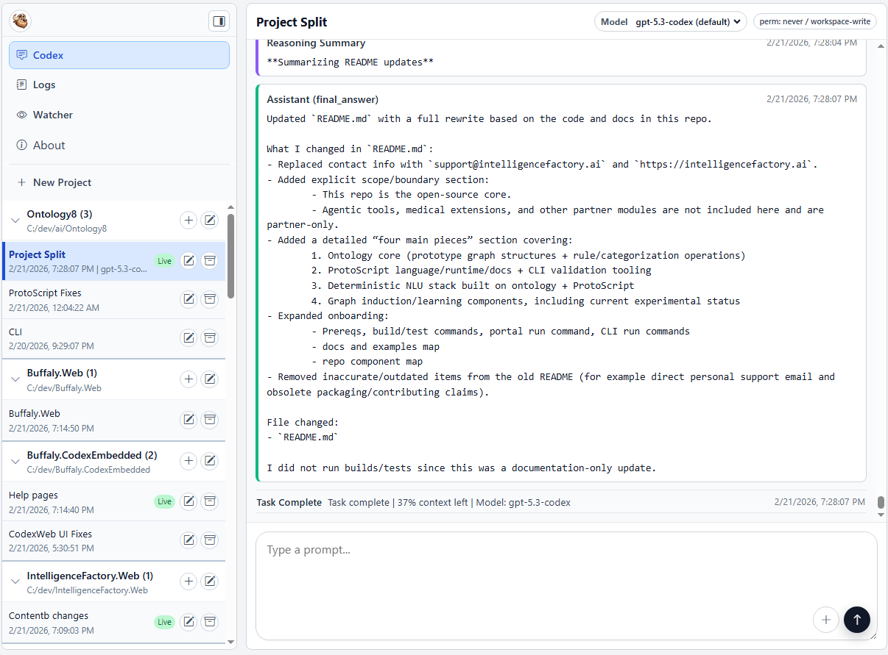

Desktop project list with multiple active sessions.

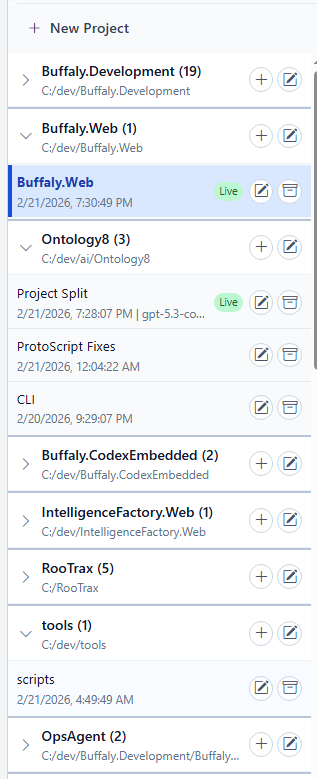

The same project model works on desktop and mobile, with active status and quick actions. Mobile project list over private tailnet access.

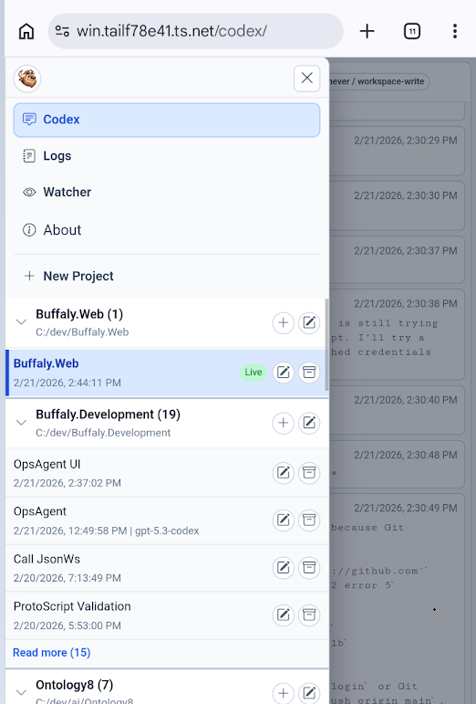

### 2. Prompting that feels native

Type naturally, edit freely, use voice to text and attach images directly in the composer. Easily select and copy / paste text, 
make edits before sending, and let Codex see images without extra steps. No arrow key editing or painful windows CLI based copy paste.

Queue, guide, cancel the Codex assistant with key commands and buttons in the UI.

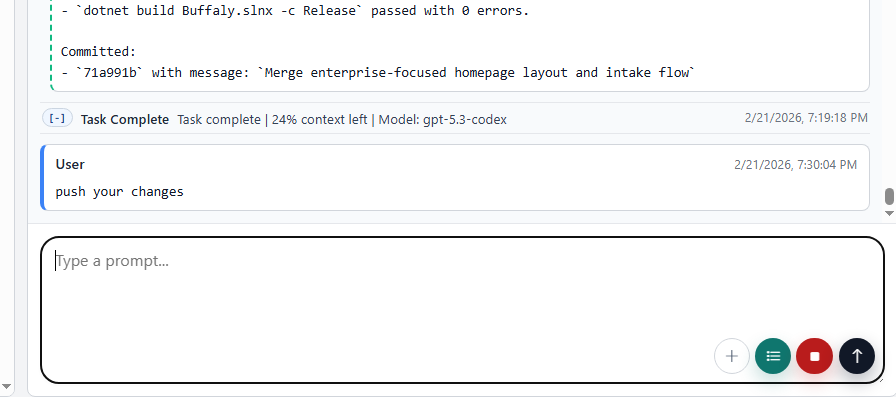

Image preview chip in the composer before send.

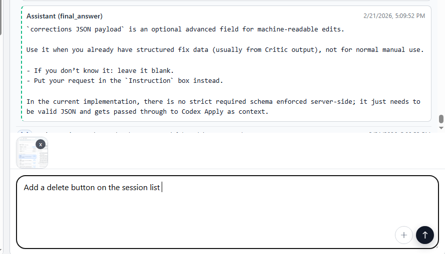

Image context is carried into the message so Codex can use it immediately.

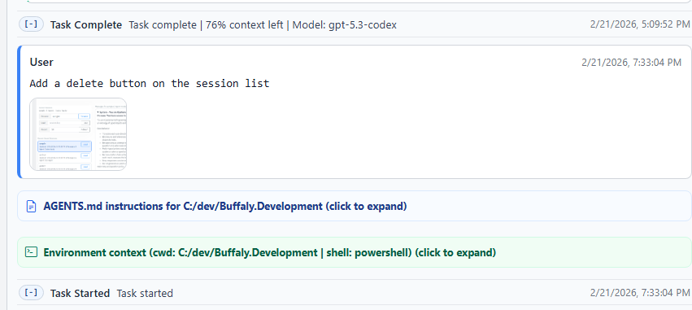

### 3. Persistent timeline and context continuity

Every session keeps a readable timeline so you can resume old work without terminal scrollback hunting. C

State stays visible, including what ran, what failed, what changed, and what to do next.

Conversation timeline with assistant and tool entries.

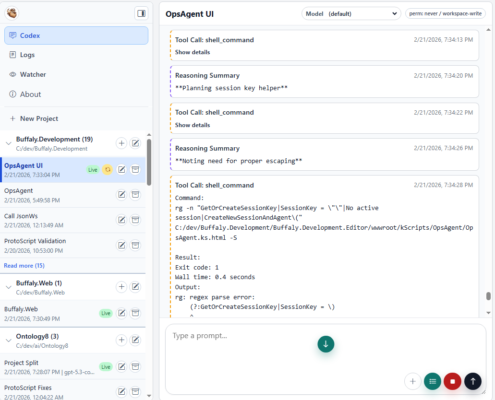

Timeline showing resumed task context and follow-up actions.

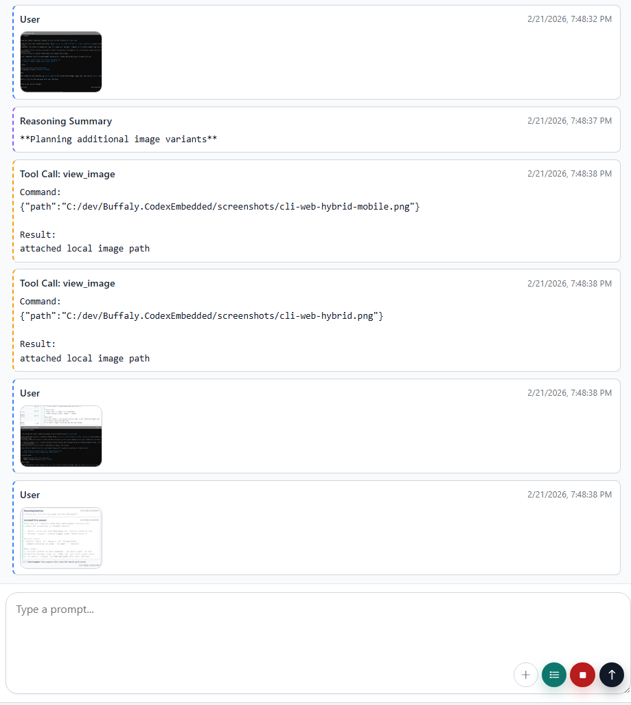

### 4. Hybrid web plus terminal workflow

Use the web UI for context and review, while running focused CLI commands in parallel.

Web gives visibility while the terminal gives precision, both on the same Codex workflow.

Desktop web interface during an active coding session.

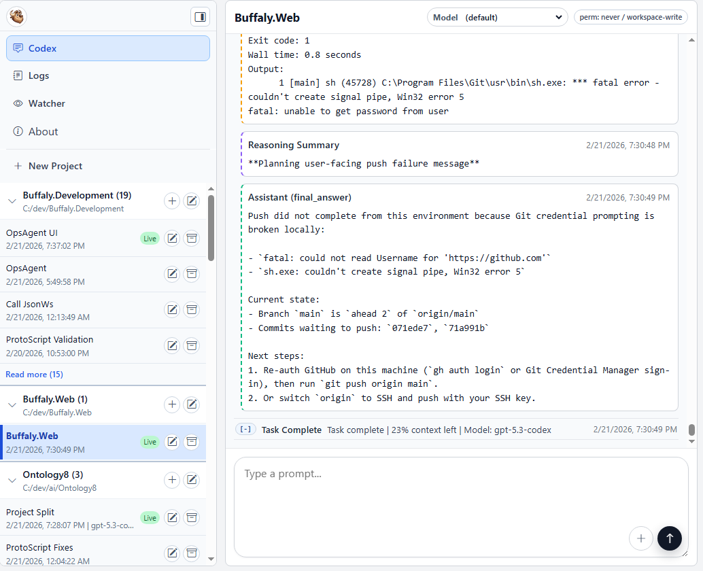

Terminal window running commands for the same work session.

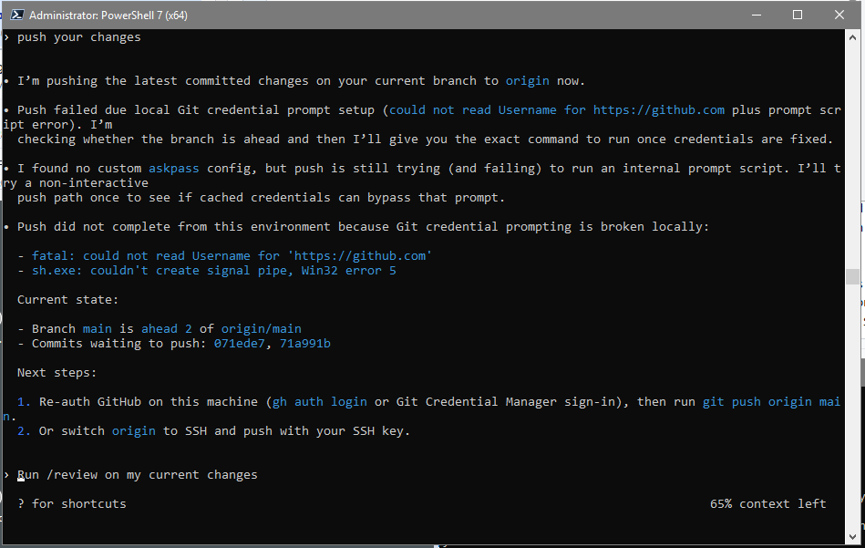

### 5. True cross-device continuation

Start on desktop, continue on phone, keep the same session state and thread context.

Desktop, terminal, and phone stay in one shared workflow with no context reset.

Desktop web UI for an active Codex session.


CLI window running focused commands for the same work.


Mobile view continuing the same session over Tailscale.

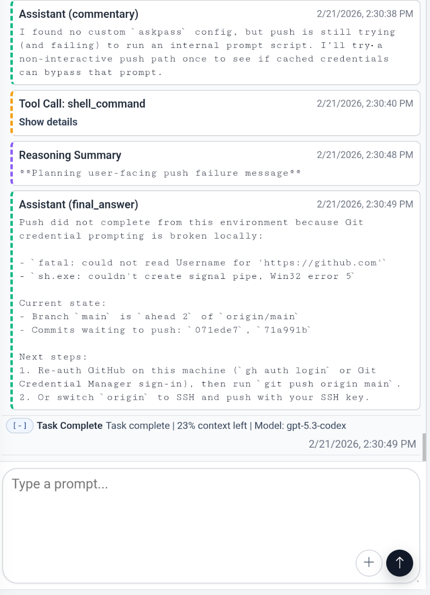

## Why We Built This

We use Codex internally at IntelligenceFactory.ai to build [buffa.ly](https://buffa.ly/?utm_source=codexembedded&utm_medium=readme).

We built this tool because we use this tool. 

## 🌟 Why You’ll Love This (vs raw Codex CLI)

| What’s hard with the raw CLI          | How Buffaly Codex Embedded makes it easy |
|---------------------------------------|------------------------------------------|
| One terminal session at a time        | Juggle 5-6 projects with persistent sessions open side-by-side |
| Clunky arrow-key editing              | Natural browser input - full edit, undo, copy-paste |
| Images/screenshots are painful        | Paste screenshots directly into the chat - Codex sees them instantly |
| History lost in scrollback            | Clean per-session timeline - scroll back and resume anytime |
| Hard to mix quick tasks & deep work   | Run the `buffaly-codex` CLI and web UI **at the same time** - both stay in sync |
| Switching devices is a hassle         | Start on desktop → continue on phone → same conversation, same files, same agent state |

**Same official Codex agent. Easier developer experience.**

## 🚀 Detailed Install and Run Options

### 1. Prerequisites

- Windows Enviroment with .NET 9.x runtime
- `codex` CLI installed and authenticated
- Internet access (for updates)

Confirm Codex is ready:

```powershell
codex --version
```

### 2. Install wrapper commands (recommended)

1. Open **Actions** in this repo.
2. Open the latest successful `release` workflow run.
3. Download the artifact `release-win-x64-<version>`.
4. Extract the zip.
5. Open PowerShell in the extracted folder.
6. Run:

```powershell
pwsh -ExecutionPolicy Bypass -File .\install.ps1
```

This installs wrapper commands on your PATH, including `buffaly-codex-web`.

If you prefer the launcher script, use:

```powershell
.\install.cmd
```

If PowerShell 7 is not available, use:

```powershell
C:\Windows\System32\WindowsPowerShell\v1.0\powershell.exe -NoProfile -ExecutionPolicy Bypass -File .\install.ps1
```

Installer preflight checks Codex availability and local auth artifacts.
If checks fail, install still completes and prints clear warnings with next steps.

### 3. Launch browser UI after install

After install, open a new terminal:

```powershell
buffaly-codex-web
```

`buffaly-codex-web` prints `Now listening on:` in the terminal. Open that URL in your browser.

### 4. Run manually from the package (no install)

1. Extract the downloaded zip.
2. Open `apps\web`.
3. Run `Buffaly.CodexEmbedded.Web.exe`.
4. Open the URL shown after `Now listening on:`.

### 5. Run from source (developer)

From repo root:

```powershell
dotnet restore
dotnet build
dotnet run --project Buffaly.CodexEmbedded.Web
```

### 6. Other commands after install

- `buffaly-codex-web`: launch the web UI.
- `buffaly-codex`: interactive REPL mode.
- `buffaly-codex run --prompt "<text>"`: one-shot prompt.
- `buffaly-codex-update`: download and install latest workflow artifact or tagged release.
- `buffaly-codex-uninstall`: remove the local install.

### 7. Try a real workflow

```powershell
buffaly-codex-web
# In another terminal window:
buffaly-codex run --prompt "Refactor the payment service and add tests" --cwd "C:\Projects\MyApp"
```

## Troubleshooting

- `install.ps1` fails with "release-manifest.json was not found":
  Run installer from the extracted package root folder that contains `release-manifest.json`, `apps\`, and `install.ps1`.
- `powershell` command is not recognized:
  Use `pwsh -ExecutionPolicy Bypass -File .\install.ps1` (PowerShell 7) or use the full Windows PowerShell path shown above.
- Web UI starts but sessions fail:
  Confirm `codex --version` works, then run `codex login`.
- `buffaly-codex-web` is not found after install:
  Open a new terminal so updated PATH is loaded.

## 📱 Codex in Your Pocket - Seamless Device Switching

Start a refactoring session on your desktop web UI, grab your phone on the train, open the same Tailscale URL, and continue exactly where you left off - same conversation, same files, same agent state.

(Full Tailscale setup instructions below - same private, secure approach we recommend for all high-trust agent work.)

1. Install and sign in to Tailscale on:

the machine running this UI

your phone (or other device)

2. Enable MagicDNS and HTTPS certificates in the Tailscale admin console.

3. On the machine running this UI, publish the local port to your tailnet only:

```powershell
tailscale serve --bg 5173
tailscale serve status
```

4. On your phone (on the same tailnet), open the URL shown by tailscale serve status, for example: https://win.<your-tailnet>.ts.net/

If the hostname does not resolve on a client, run this on the client:

```powershell
tailscale set --accept-dns=true
```

More: docs/tailscale.md (slugs, multiple ports, HTTPS upstream, troubleshooting)

## Security

**Codex can read, write, and execute code on your machine.**  
Buffaly Codex Embedded makes it dramatically easier and more pleasant to use - so we made security first-class: localhost-only by default, optional auth token, and Tailscale-only publishing recommended.

Do not expose it to the public internet.

Recommended: bind to 127.0.0.1 only and publish privately via Tailscale Serve.

WebSocket connections require an auth token by default.

More: docs/security.md (threat model, safe deployment patterns, troubleshooting)

## Configure After Install

You can edit defaults in:

- `%LOCALAPPDATA%\Buffaly.CodexEmbedded\versions\<active-version>\apps\cli\appsettings.json`
- `%LOCALAPPDATA%\Buffaly.CodexEmbedded\versions\<active-version>\apps\web\appsettings.json`

Most common settings:

- `CodexPath`: command/path for Codex executable (default: `codex`)
- `DefaultCwd`: default working folder
- `TimeoutSeconds` or `TurnTimeoutSeconds`
- log paths (`LogFilePath`, `LogRootPath`)

When you update, installer keeps your existing `appsettings.json` files.

## 👩‍💻 For Developers & Maintainers

## Build From Source (Developer)

### Prerequisites

- .NET SDK 9.x
- Git
- `codex` CLI installed/authenticated

### Build, test, run

```powershell
dotnet restore
dotnet build
dotnet test
```

Run CLI:

```powershell
dotnet run --project Buffaly.CodexEmbedded.Cli -- run --prompt "Say hello in one sentence"
```

Run Web host:

```powershell
dotnet run --project Buffaly.CodexEmbedded.Web
```

## Release Build and Packaging

Manual release commands:

```powershell
./scripts/release/build.ps1 -Configuration Release
./scripts/release/publish.ps1 -Runtime win-x64 -Configuration Release -OutputRoot artifacts/publish
./scripts/release/package.ps1 -Runtime win-x64 -Version v1.0.0 -Repository <owner/repo> -PublishRoot artifacts/publish -OutputRoot artifacts/release
```

Generated files:

- `artifacts/release/Buffaly.CodexEmbedded-win-x64-<version>.zip`
- `artifacts/release/SHA256SUMS-win-x64-<version>.txt`

## GitHub Release Automation

Workflow: `.github/workflows/release.yml`

- Push tag `v*` to build/test/publish/package automatically.
- Assets are attached to the GitHub release for non-technical users to download.

## Project Layout

- `Buffaly.CodexEmbedded.Cli`: terminal harness
- `Buffaly.CodexEmbedded.Web`: browser-based multi-session UI
- `Buffaly.CodexEmbedded.Core`: reusable client library
- `scripts/release`: maintainer build/publish/package scripts
- `install/package`: installer/update/uninstall scripts bundled into release zip

## ❤️ Discover Buffaly

Loved this experience?  
Buffaly is the production-grade version of the same philosophy: local agents you can actually trust in serious work.

[→ Stop Prompting. Start Programming Your Agents →](https://buffa.ly/?utm_source=codexembedded&utm_medium=readme&utm_campaign=footer)

---

**Part of the Buffaly ecosystem from Intelligence Factory LLC**  
Built with the same care we put into safe, auditable agents for medicine and other high-trust domains.  
Learn more at [buffa.ly](https://buffa.ly)

## Disclaimers

Experimental software. Protocols and schemas may change as Codex evolves.

No warranty. Use at your own risk.

Not affiliated with OpenAI.

Do not run on machines containing secrets you are not willing to expose to a tool-driven agent.
