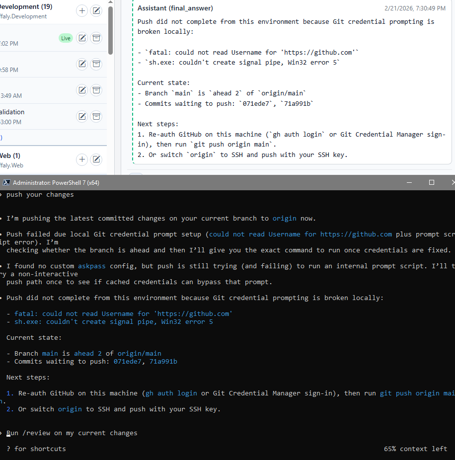

<div align="center">
# 🌟 Buffaly Codex Embedded

**Unofficial Windows-first UI for OpenAI Codex**  
Run the official Codex agent in a beautiful browser UI - on your desktop, from your phone, or alongside the CLI.

[](https://github.com/Intelligence-Factory-LLC/Buffaly.CodexEmbedded)
[](https://dotnet.microsoft.com)
[](LICENSE)
[](https://github.com/Intelligence-Factory-LLC/Buffaly.CodexEmbedded/releases)
</div>

## 🌟 What is Buffaly Codex Embedded?

**The unofficial Windows-first UI that makes OpenAI Codex actually delightful to use.**

Run the official Codex agent in a clean browser interface on your desktop, from your phone, or right next to the CLI - no waiting for the official Windows app.

You get:
- Multiple projects open at once (no more restarting terminals)
- Natural editing, image paste, and full history
- Seamless switching between desktop, web, and phone
- Same powerful Codex agent under the hood

Built by the team behind **Buffaly** - the local agent platform for high-trust work.

### 📸 See It In Action

Typical flow:

1. Open a project in the sidebar and continue an existing thread.
2. Send prompts with text plus screenshot context.
3. Monitor tool calls and reasoning in the timeline.
4. Run targeted terminal commands with `buffaly-codex` when needed.
5. Continue the same session on mobile over your private tailnet.

<div align="center">
  
  <br><sub>Live workflow demo across desktop web, terminal, and mobile continuation.</sub>
</div>

<div align="center">
  
  <br><sub>Static reference view of the same hybrid workflow.</sub>
</div>

## ✨ Major Features

The experience is organized around real coding workflows. Each screenshot below maps to one concrete advantage.

### 1. Multi-project command center

Keep many repos active at once, switch threads instantly, and stay oriented by project.

<div align="center">
  
  <br><sub>Full workspace view: project sidebar on the left, active session and timeline on the right.</sub>
</div>

<div align="center">
  
  
  <br><sub>Same project model on desktop and mobile, including active status and quick actions.</sub>
</div>

### 2. Prompting that feels native

Type naturally, edit freely, and attach images directly in the composer.

<div align="center">
  
  
  <br><sub>Compose long prompts, then drop screenshots without leaving the flow.</sub>
</div>

<div align="center">
  
  <br><sub>Image context is carried into the message so Codex can use it immediately.</sub>
</div>

### 3. Persistent timeline and context continuity

Every session keeps a readable timeline so you can resume old work without terminal scrollback hunting.

<div align="center">
  
  
  <br><sub>State stays visible: what ran, what failed, what changed, and what to do next.</sub>
</div>

### 4. Hybrid web plus terminal workflow

Use the web UI for context and review, while running focused CLI commands in parallel.

<div align="center">
  
  
  <br><sub>Web for visibility, terminal for precision, both on the same underlying Codex workflow.</sub>
</div>

### 5. True cross-device continuation

Start on desktop, continue on phone, keep the same session state and thread context.

<div align="center">
  
  
  
  <br><sub>Desktop, terminal, and phone stay in one shared workflow with no context reset.</sub>
</div>

## Why We Built This

We believe powerful agents should feel delightful to use every single day.  
As the team behind **Buffaly** - the ontology-driven agent platform that powers safe, auditable AI in high-trust environments like medicine - we wanted developers to experience how good Codex can really feel on Windows and mobile.

This project is our way of giving the community a polished, multi-project interface while we continue building the future of trustworthy agent infrastructure at [buffa.ly](https://buffa.ly).

## 🌟 Why You’ll Love This (vs raw Codex CLI)

| What’s hard with the raw CLI          | How Buffaly Codex Embedded makes it easy |
|---------------------------------------|------------------------------------------|
| One terminal session at a time        | Juggle 5-6 projects with persistent sessions open side-by-side |
| Clunky arrow-key editing              | Natural browser input - full edit, undo, copy-paste |
| Images/screenshots are painful        | Paste screenshots directly into the chat - Codex sees them instantly |
| History lost in scrollback            | Clean per-session timeline - scroll back and resume anytime |
| Hard to mix quick tasks & deep work   | Run the `buffaly-codex` CLI and web UI **at the same time** - both stay in sync |
| Switching devices is a hassle         | Start on desktop → continue on phone → same conversation, same files, same agent state |

**Same official Codex agent. Dramatically better developer experience.**

## 🚀 Quick Start (Windows - 2 minutes)

### 1. Prerequisites

- Windows 10/11
- `codex` CLI installed and authenticated
- Internet access (for updates)

Confirm Codex is ready:

```powershell
codex --version
```

### 2. Download and install

1. Open the project **Releases** page.
2. Download the latest `Buffaly.CodexEmbedded-win-x64-<version>.zip`.
3. Extract the zip.
4. Open PowerShell in the extracted folder.
5. Run:

```powershell
powershell -NoProfile -ExecutionPolicy Bypass -File .\install.ps1
```

### 3. Start using it

After install, open a new terminal:

```powershell
buffaly-codex run --prompt "Say hello in one sentence"
buffaly-codex-web
```

Useful commands:

- `buffaly-codex`: interactive REPL mode.
- `buffaly-codex run --prompt "<text>"`: one-shot prompt.
- `buffaly-codex-update`: download and install latest release.
- `buffaly-codex-uninstall`: remove the local install.

### Try a real workflow

```powershell
buffaly-codex-web
# In another terminal window:
buffaly-codex run --prompt "Refactor the payment service and add tests" --cwd "C:\Projects\MyApp"
```

## 📱 Codex in Your Pocket - Seamless Device Switching

Start a refactoring session on your desktop web UI, grab your phone on the train, open the same Tailscale URL, and continue exactly where you left off - same conversation, same files, same agent state.

(Full Tailscale setup instructions below - same private, secure approach we recommend for all high-trust agent work.)

1. Install and sign in to Tailscale on:

the machine running this UI

your phone (or other device)

2. Enable MagicDNS and HTTPS certificates in the Tailscale admin console.

3. On the machine running this UI, publish the local port to your tailnet only:

```powershell
tailscale serve --bg 5173
tailscale serve status
```

4. On your phone (on the same tailnet), open the URL shown by tailscale serve status, for example: https://win.<your-tailnet>.ts.net/

If the hostname does not resolve on a client, run this on the client:

```powershell
tailscale set --accept-dns=true
```

More: docs/tailscale.md (slugs, multiple ports, HTTPS upstream, troubleshooting)

## Security

**Codex can read, write, and execute code on your machine.**  
Buffaly Codex Embedded makes it dramatically easier and more pleasant to use - so we made security first-class: localhost-only by default, optional auth token, and Tailscale-only publishing recommended.

Do not expose it to the public internet.

Recommended: bind to 127.0.0.1 only and publish privately via Tailscale Serve.

WebSocket connections require an auth token by default.

More: docs/security.md (threat model, safe deployment patterns, troubleshooting)

## Configure After Install

You can edit defaults in:

- `%LOCALAPPDATA%\Buffaly.CodexEmbedded\versions\<active-version>\apps\cli\appsettings.json`
- `%LOCALAPPDATA%\Buffaly.CodexEmbedded\versions\<active-version>\apps\web\appsettings.json`

Most common settings:

- `CodexPath`: command/path for Codex executable (default: `codex`)
- `DefaultCwd`: default working folder
- `TimeoutSeconds` or `TurnTimeoutSeconds`
- log paths (`LogFilePath`, `LogRootPath`)

When you update, installer keeps your existing `appsettings.json` files.

<details>
<summary>👩‍💻 For Developers & Maintainers</summary>

## Build From Source (Developer)

### Prerequisites

- .NET SDK 9.x
- Git
- `codex` CLI installed/authenticated

### Build, test, run

```powershell
dotnet restore
dotnet build
dotnet test
```

Run CLI:

```powershell
dotnet run --project Buffaly.CodexEmbedded.Cli -- run --prompt "Say hello in one sentence"
```

Run Web host:

```powershell
dotnet run --project Buffaly.CodexEmbedded.Web
```

## Release Build and Packaging

Manual release commands:

```powershell
./scripts/release/build.ps1 -Configuration Release
./scripts/release/publish.ps1 -Runtime win-x64 -Configuration Release -OutputRoot artifacts/publish
./scripts/release/package.ps1 -Runtime win-x64 -Version v1.0.0 -Repository <owner/repo> -PublishRoot artifacts/publish -OutputRoot artifacts/release
```

Generated files:

- `artifacts/release/Buffaly.CodexEmbedded-win-x64-<version>.zip`
- `artifacts/release/SHA256SUMS-win-x64-<version>.txt`

## GitHub Release Automation

Workflow: `.github/workflows/release.yml`

- Push tag `v*` to build/test/publish/package automatically.
- Assets are attached to the GitHub release for non-technical users to download.

## Project Layout

- `Buffaly.CodexEmbedded.Cli`: terminal harness
- `Buffaly.CodexEmbedded.Web`: browser-based multi-session UI
- `Buffaly.CodexEmbedded.Core`: reusable client library
- `scripts/release`: maintainer build/publish/package scripts
- `install/package`: installer/update/uninstall scripts bundled into release zip

</details>

## ❤️ Discover Buffaly

Loved this experience?  
Buffaly is the production-grade version of the same philosophy: local agents you can actually trust in serious work.

[→ Stop Prompting. Start Programming Your Agents →](https://buffa.ly/?utm_source=codexembedded&utm_medium=readme&utm_campaign=footer)

---

**Part of the Buffaly ecosystem from Intelligence Factory LLC**  
Built with the same care we put into safe, auditable agents for medicine and other high-trust domains.  
Learn more at [buffa.ly](https://buffa.ly)

## Disclaimers

Experimental software. Protocols and schemas may change as Codex evolves.

No warranty. Use at your own risk.

Not affiliated with OpenAI.

Do not run on machines containing secrets you are not willing to expose to a tool-driven agent.
