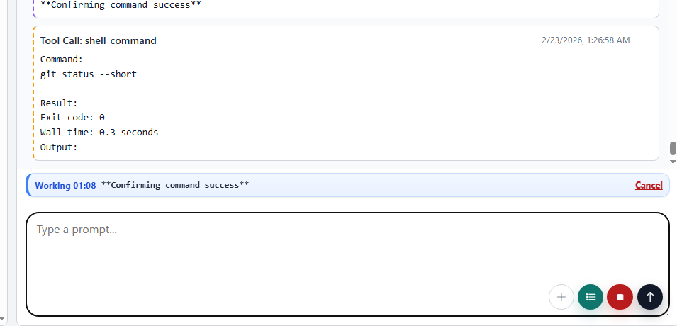
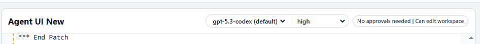
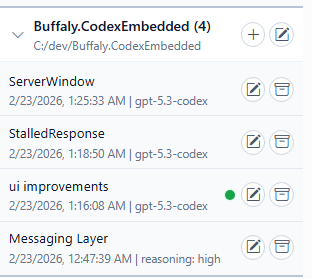
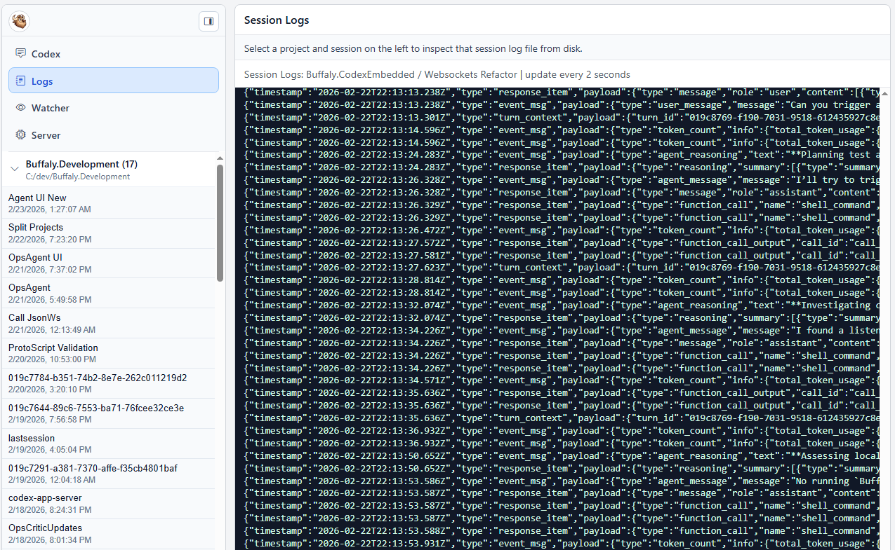
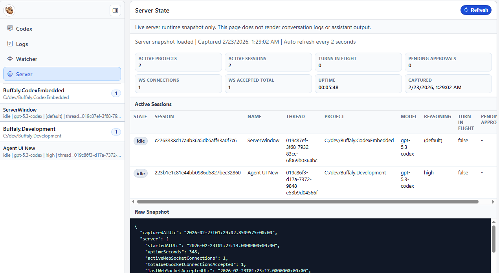

# Release Notes - February 23, 2026

## New Features

### UI Improvements

This update is mostly about making long running work easier to track and easier to interrupt.

- Live turn activity strip with a running timer and a quick cancel link.
- Reasoning display is cleaner and more reliable in-flight because it keys off task boundaries instead of timing quirks.
- Sidebar status is more trustworthy: processing badges and timestamps reflect real updates, not attach time.

- Easier model selection with reasoning level controls in one place.

- Notification bubbles on tasks when they complete.

### Server Improvements

- The server now runs on a stronger orchestrator, so it is more stable under load (lots of active sessions) and recovers better after restarts.
- New server state page at `/server` with a runtime snapshot view, plus some usability cleanup (labels, badges, refresh button contrast).

### New Developer Features

- Realtime logs screen at `/logs` showing live Codex to server communication over the app-server JSON-RPC protocol.

- Watcher screen at `/watcher` for monitoring CLI or Web sessions using the same timeline style as the main UI.

- Server state screen at `/server` for visibility into what the orchestrator thinks is happening (websocket connections and app-server communication).

### Reliability and Sync Improvements

- Improved session message handling and timeline sync for assistant response events.
- Hardened the UI and websocket event pipeline against message floods and redundant updates.
- Better recovery for stuck turns: core completion signals are used to unwind state, and `task_complete` is treated as authoritative turn completion (with updated core tests).
