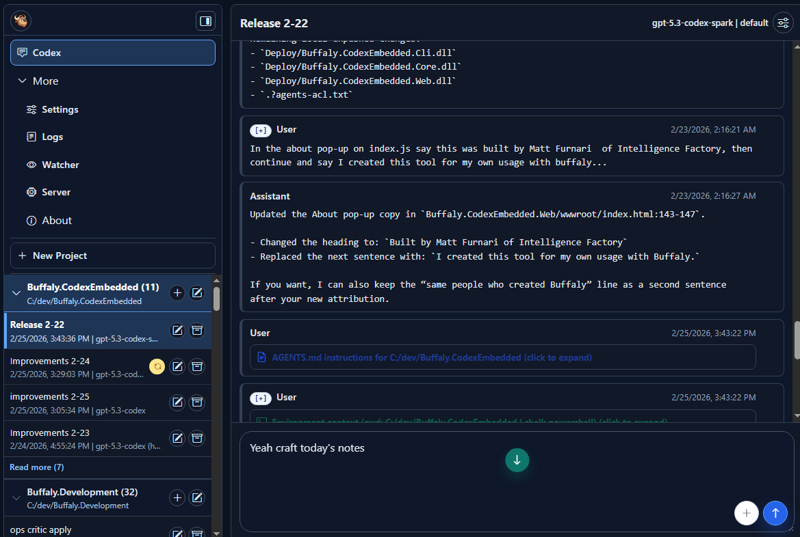

# Release Notes - February 25, 2026

## New Features

### UI and Workflow Improvements

We made several changes to make the workspace easier to scan and manage during long sessions.

- Added a new settings page with a theme toggle and collapsible sidebar navigation.
- Added a new compact timeline jump mode that makes it faster to jump between user messages.
- Added support for collapsing expanded sections so timeline details stay manageable.
- Restored model and reasoning labels in the header settings menu so context is always clear.
- Improved dark mode visibility in project and selection states for better readability.

### Reliability Improvements

Session state is now more reliable after cancels, catalog updates, and recovery edges.

- Fixed stale processing UI after cancel acknowledgements and catalog merges.
- Improved cancel fallback behavior when a forced clear is needed.
- Generalized stale inferred turn recovery for any in-flight turn.
- Added recover logic for inferred stale turns based on log inactivity.
- Aligned cancel status text with forced state clear states.

### Timeline and Header Clarity

- Simplified the timeline header model and reasoning summary presentation.
- Restored model and reasoning labels in the session header controls after the compact redesign.
- Kept dark mode sidebar and project label visibility tuned for longer use sessions.
