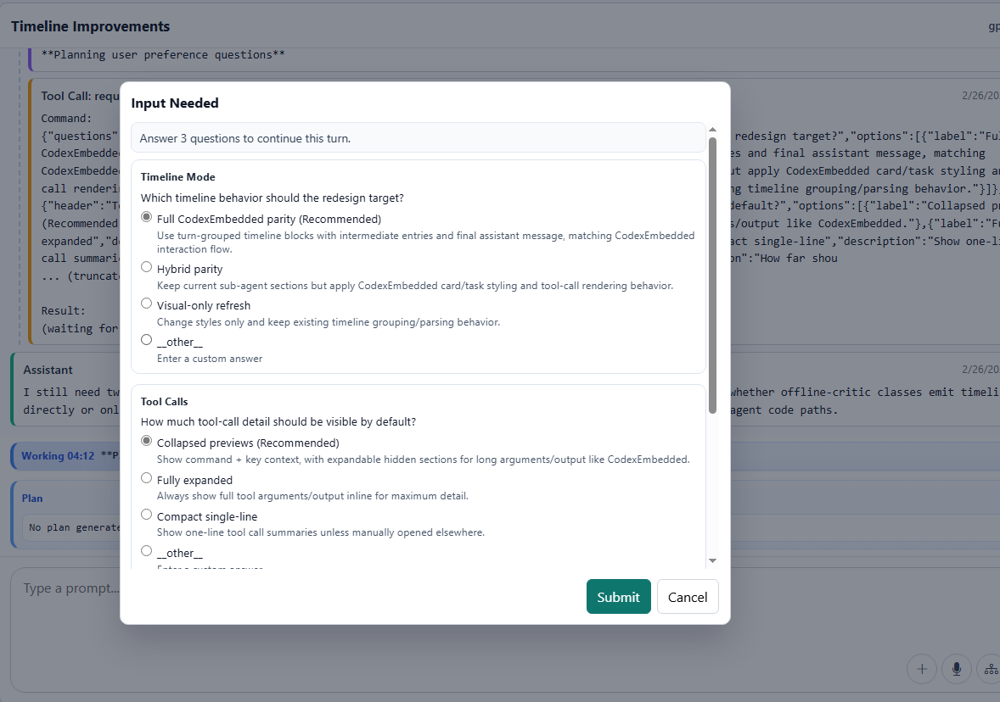
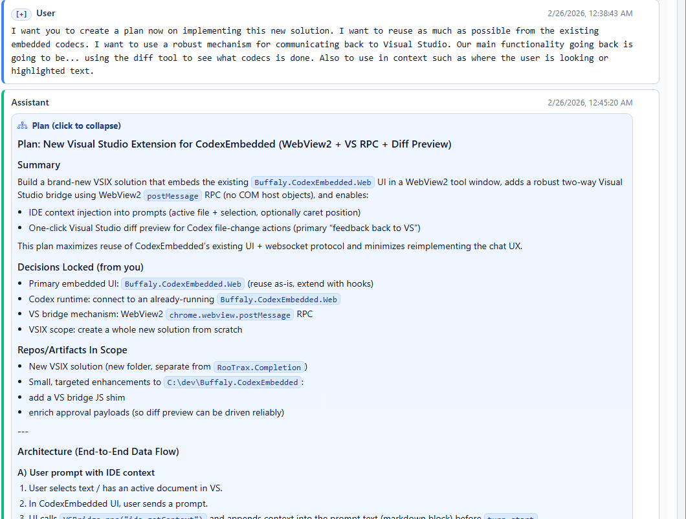
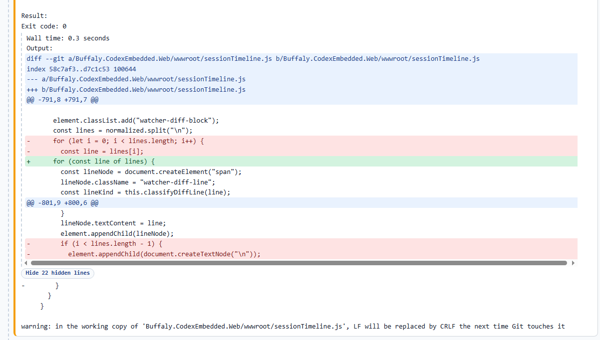

# Release Notes - February 27, 2026

## New Features

This release focuses on faster long-session review, stronger recap workflows, and better state recovery under real multi-session load.

### UI Improvements

Long conversations are now easier to scan and navigate without losing detail when you need it.

- Added recap mode at `/recap` with day and query drill-in plus a live recap timeline.
- Added recap report history in the sidebar and aligned recap controls with the main index UI.
- Upgraded the plan stream UI to a compact single-line status strip plus expandable proposed-plan cards.
- Added canonical markdown rendering with delta reconciliation for plan output.
- Added diff-style highlighting for timeline tool output and code blocks.
- Reduced noisy default tool preview lines and added expandable hidden-line previews.

### Server and Timeline Improvements

Timeline loading and session attach paths were reworked to improve speed and consistency.

- Split turns APIs into bootstrap, watch, and detail endpoints with shallow turn summaries.
- Switched UI to shallow bootstrap with lazy turn-detail hydration for faster initial render.
- Removed the legacy timeline endpoint and increased the bootstrap window for cleaner flow.
- Emitted authoritative `session_attached` when attaching loaded threads.
- Tuned `/server` auto-refresh timing so state snapshots are easier to copy and inspect.

### New Developer Features

This release adds practical controls for plan collaboration and speech workflows.

- Integrated Codex protocol plan collaboration mode with explicit default-mode handling.
- Added end-to-end handling for plan-mode user input requests.
- Added OpenAI API key management for app flows that require external service calls.
- Added segmented speech-to-text frontend wiring and recap voice updates in-session.

### Reliability and Recovery Improvements

Recovery logic was hardened across recap, timeline, and turn lifecycle states.

- Added automatic recovery for stale pending turn-start sessions.
- Fixed speech transcription 400 retry loops and improved single-key lookup behavior.
- Fixed extra blank lines in timeline diff rendering.
- Hardened recap routing and binding for hosted base paths and single-session context.
- Enforced recap workspace defaults for safe read-only/no-approval operation.
- Tightened tool input modal behavior to require explicit selection.

