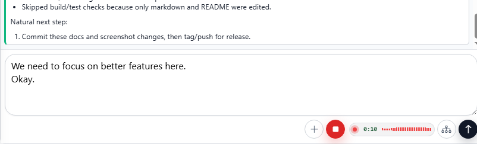
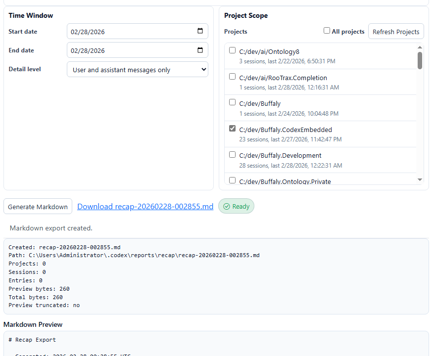

# Release Notes - February 27, 2026

## New Features

This release is all about working faster and safer across long conversations and multiple sessions, with full Planning Mode support, voice dictation, and a new recap workflow you can export anywhere. 🚀

### 🧠 Planning Mode (Fully Supported)

Planning Mode is now end-to-end: stream a plan, review it, approve it, and keep going without losing state.

- Streaming plan output now stays readable with a compact single-line status strip.
- Proposed plans render as expandable timeline cards, so you can approve and reference them later.
- Plan output is rendered as canonical markdown with delta reconciliation during streaming.

### 🎙️ Voice Dictation

Voice dictation is now supported for easier prompt entry when you want to move quickly.

### 🧾 Recap Screen (Export-Friendly)

The new recap screen is built for end-of-day reports, sharing with teammates, and exporting your work to other LLMs for summaries or deeper research.

- Added recap mode at `/recap` with day and query drill-in plus a live recap timeline.
- Added recap report history in the sidebar and aligned recap controls with the main index UI.

### ⚡ Long Conversation Review

Long sessions are easier to review without getting buried in raw tool output.

- Added diff-style highlighting for timeline tool output and code blocks.
- Reduced noisy default tool preview lines and added expandable hidden-line previews.
- Fixed extra blank lines in timeline diff rendering.

### Server and Timeline Improvements

Timeline loading and session attach paths were reworked to improve speed and consistency.

- Split turns APIs into bootstrap, watch, and detail endpoints with shallow turn summaries.
- Switched UI to shallow bootstrap with lazy turn-detail hydration for faster initial render.
- Removed the legacy timeline endpoint and increased the bootstrap window for cleaner flow.
- Emitted authoritative `session_attached` when attaching loaded threads.
- Tuned `/server` auto-refresh timing so state snapshots are easier to copy and inspect.

### 🧩 Multi-Session Safety and Reliability

You can run more Codex sessions at once without the UI getting confused, even when sessions reconnect or recover.

- Added automatic recovery for stale pending turn-start sessions.
- Improved attach behavior by emitting authoritative `session_attached` for loaded thread attach.
- General cleanup across recap, timeline, and turn lifecycle handling.

### 🛠️ Developer and Integrations

This release adds practical controls for plan collaboration and speech workflows.

- Integrated Codex protocol plan collaboration mode with explicit default-mode handling.
- Added end-to-end handling for plan-mode user input requests.
- Added OpenAI API key management for app flows that require external service calls.
- Added segmented speech-to-text frontend wiring and recap voice updates in-session.

### 🧹 Cleanup and Fixes

- Fixed speech transcription 400 retry loops and improved single-key lookup behavior.
- Hardened recap routing and binding for hosted base paths and single-session context.
- Enforced recap workspace defaults for safe read-only/no-approval operation.
- Tightened tool input modal behavior to require explicit selection.
