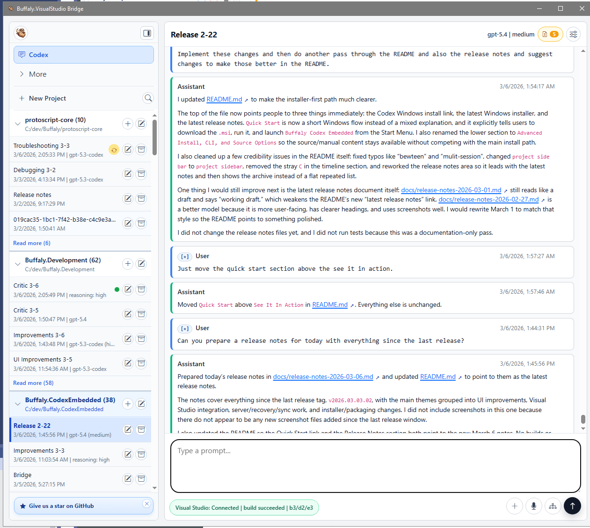
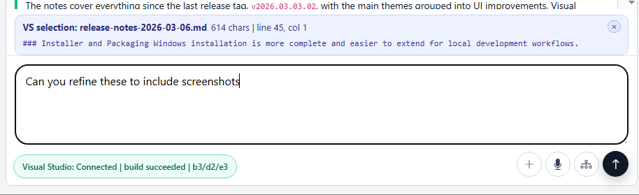
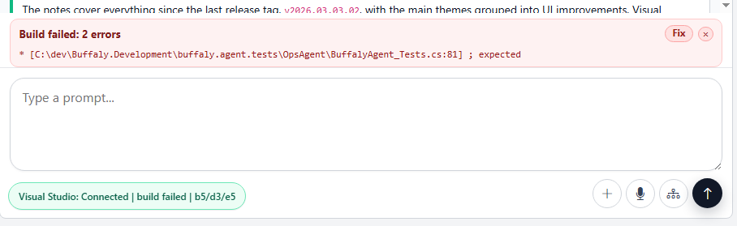
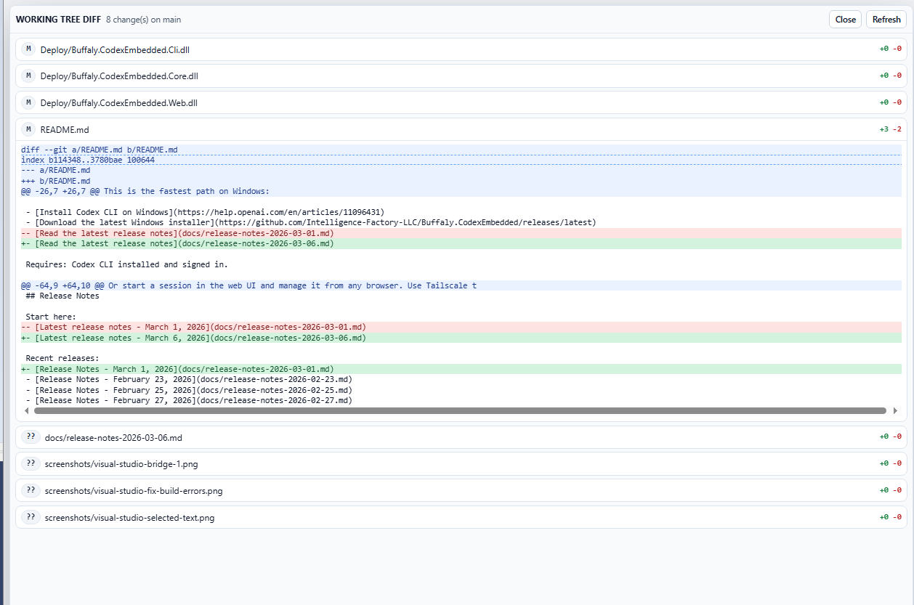
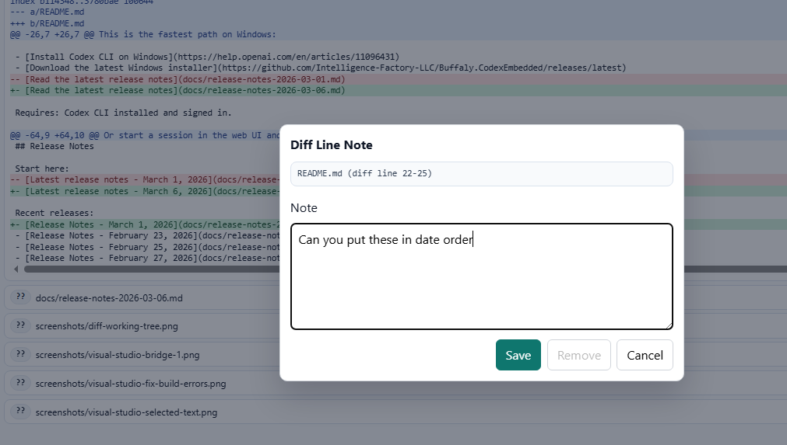
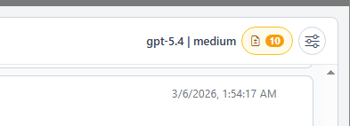

# Release Notes - March 6, 2026

## New Features

This release focuses on making day-to-day Codex work more stable, easier to recover, and much easier to drive from both the web UI and Visual Studio.

### Visual Studio Integration

Visual Studio is now much more tightly woven into the same workspace, so you can move from editor context to Codex feedback without breaking flow.

- Added the hosted Visual Studio bridge so the workspace can reflect editor state and build activity directly.
- Added a live Visual Studio selection chip so the code you highlight can be pulled straight into the next prompt.
- Added a build-fix clip chip that can attach failed build output directly into the next prompt.
- Marked Visual Studio-openable file links directly in the timeline and prompt output.
- Added a subtle arrow treatment for VS-enhanced file links so they stand out without overpowering the UI.
- Improved the VS selection chip styling and consumed VS selection context automatically after a successful send or queue.

### Diff Review and Feedback

The workspace is better at showing exactly what changed and letting you steer the next step from the same screen.

- Added a git worktree diff overlay with line notes and prompt metadata.
- Tightened diff-note send behavior so feedback can be attached with less friction.
- Improved timeline diff rendering and related UI polish so review stays readable during active work.

### UI Improvements

The web UI now does a better job of staying out of your way while still surfacing the right context at the right time.

- Persisted unsent image attachments when switching sessions so draft work is less likely to get lost.
- Restored the turn collapse control on task completion rows for easier long-session review.
- Prevented stale reasoning previews from carrying into a new turn and restored reasoning summaries more consistently.
- Tightened timeline reasoning fallback to keep the conversation view cleaner and more accurate.
- Improved error handling UI so app-server auth and core runtime problems are surfaced more clearly.
- Expanded model availability in the picker, including the new 5.4 option when it is available in your runtime.

### Server, Recovery, and Sync Improvements

Session orchestration and recovery are more predictable under load, especially when turns get stuck or app-server state shifts underneath the UI.

- Added an explicit recovery-decision flow for stale turns instead of letting them linger indefinitely.
- Stopped auto-switching the active session when approval requests arrive from a different session.
- Decoupled app-server runtime lifetime from websocket cancellation so the backend is less likely to get torn down by connection churn.
- Refactored session management and tightened turn-start payload handling to keep client and server state aligned.
- Extended audit logging and core RPC diagnostics across the websocket bridge, orchestrator, and UI.

### Installer and Packaging

Windows installation is more complete and easier to extend for local development workflows.

- Improved the README install flow so the MSI and Start Menu path are the primary setup path.
- Fixed MSI packaging so required launcher `.cmd` files are generated during packaging instead of depending on untracked local files.
- Added deterministic local VSIX staging and optional MSI inclusion for the separate Visual Studio extension build artifact.
- Added support for packaging a locally staged VSIX from `lib\` without bringing Visual Studio extension source code into this repository.

### Notes

- This release also includes a broad round of deploy artifact and documentation refresh work.
- The changes in this release build on the March 3, 2026 release line and are primarily focused on polish, resilience, and local developer workflows.
